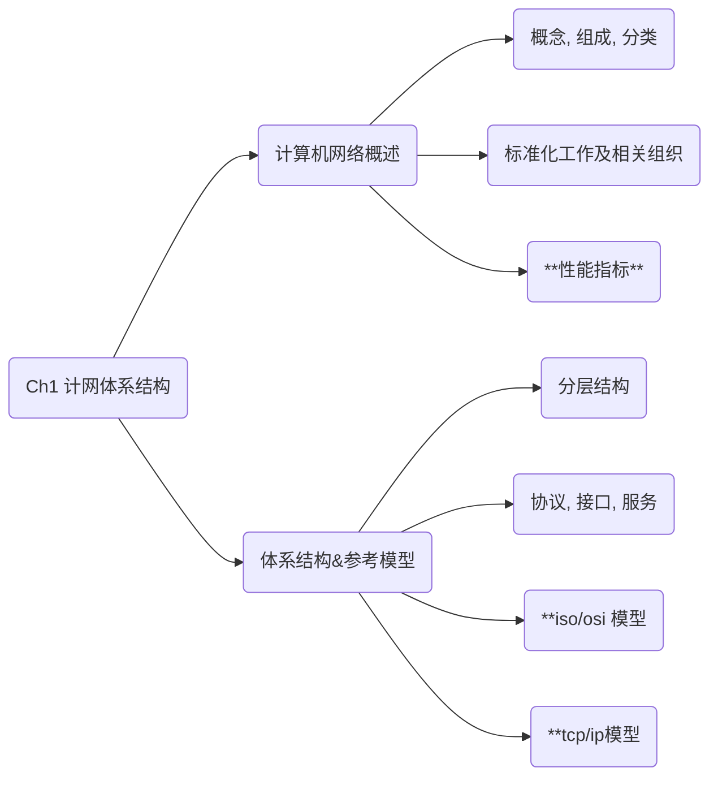

# 第一章

# 0. 计网体系结构

## 1-1. 概念和功能

### a. 计算机网络的概念

有线电视网络, 电信网络 和 计算机网络 合称 **三网**, 三网融合 的基础和媒介是 计算机网络

电网加入后, 也会称为 **四网**.

**计算机网络：**是一个将分散的、具有独立功能的**计算机系统**，通过**通信设备与线路连**接起来，由功能完善的
**软件**实现**资源共享和信息传递**的系统。

计算机网络是互连的, 自治的计算机集合

互联 -> 通过通信链路互联互通

自治 -> 没有主从关系

### b. 计算机网络的功能

1.   **数据通信**

2.   **资源共享**

     包括硬件, 软件, 数据等

3.   分布式处理

     多台计算机各自承担同一个工作的不同部分 ( Hadoop 平台)

4.   提高可靠性

     利用替代机取代失去工作能力的计算机

5.   负载均衡

     计算机之间更亲密, 效率更高

### c. 计算机网络的发展 - 第一阶段

美国国防部高级研究计划局(arpa)设计了一个分散的指挥系统 ARPAnet

后来希望实现不同网络互联, 创造了 interconnected network (internet) 互联网

1983年阿帕网接受 tcp/ip 协议 选定 Internet 为主要的计算机通信系统 --> Internet

>   `Internet`存在大小写区别
>
>   首字母小写是 interconnected network 的意思 是一个缩写
>
>   首字母大写是 Internet 因特网, 是一个专有名词

网络把许多计算机连在一起, 而互联网把许多网络连在一起, 因特网是世界上最大的互联网

### d. 计算机网络的发展 - 第二阶段 (三级结构)

1985年起, 美国国家科学基金会 nsf 围绕6个大型计算机中心建设计算机网络, 即 国家科学基金网 NSFNET.

主干网 --> 地区网 --> 企业网/校园网

### e. 计算机网络的发展 - 第二阶段 (多层次的 isp 结构)

**ISP**: 因特网服务提供者/因特网服务提供商，是一个向广大用户综合提供互联网接入业务、信息业务、和增值业务的公司，如中国电信、中国联动、中国移动等分为主干ISP、地区ISP和本地ISP。

>   isp 同样是继承了第二阶段的设计, 只是把网络管理权力分散了

因特网管理机构拥有全部的 ip 池, 由 isp 申请部分网段的 ip 值给用户

ip 地址是 isp 分配好的, 不由用户决定

**IXP:** 因特网交换点用于将两个网络直接相连, 提高了信息传递和共享的速度.

